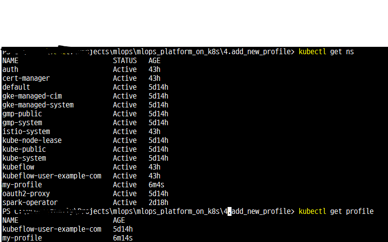

[kubeflow 프로필 공식 문서](https://www.kubeflow.org/docs/components/central-dash/profiles/)을 참고해서 작성


kubeflow 멀티 테넌시를 위한 RBAC를 프로필을 통해 관리한다.

## 새로운 프로필이 필요한 경우
- 새로운 dex 계정에 권한 추가
- 기존의 유저에게 새로운 네임스페이스 제공
- 기존의 유저에게 owner가 아닌 권한 제공


### 새 프로필 만드는 법
1. 새로운 프로필 파일을 만든다. (my-profile.yaml)

    ```yaml
    apiVersion: kubeflow.org/v1
    kind: Profile
    metadata:
    ## the profile name will be the namespace name
    ## WARNING: unexpected behavior may occur if the namespace already exists
    name: my-profile
    spec:
    ## the owner of the profile
    ## NOTE: you may wish to make a global super-admin the owner of all profiles
    ##       and only give end-users view or modify access to profiles to prevent
    ##       them from adding/removing contributors
    owner:
        kind: User
        name: test@example.com

    ## plugins extend the functionality of the profile
    ## https://github.com/kubeflow/kubeflow/tree/master/components/profile-controller#plugins
    plugins: []
    
    ## optionally create a ResourceQuota for the profile
    ## https://github.com/kubeflow/kubeflow/tree/master/components/profile-controller#resourcequotaspec
    ## https://kubernetes.io/docs/reference/kubernetes-api/policy-resources/resource-quota-v1/#ResourceQuotaSpec
    resourceQuotaSpec: {}
    ```

- owner의 name에 새로 만든 `유저`의 `이메일`을 작성한다.
- metadata의 *name*은 만들어진 `프로필의 이름`이 된다. 이는 `네임스페이스 이름`이 되기도 한다.

2. apply
   `kubectl apply -f my-profile.yaml`
3. 확인

```bash
kubectl get ns
kubectl get profile
```



*프로필을 만드는 것 != 계정을 만드는 것임에 주의하자*
